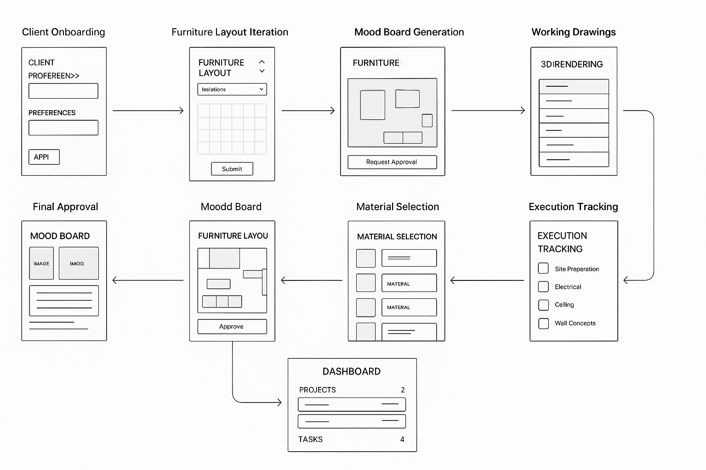

# Interior360 - Interior Design Project Management



End-to-end interior design project management platform inspired by Dzylo, providing a streamlined workflow for designers and clients.

## Features

### Current Features

- **Client Onboarding**
  - Comprehensive client information collection
  - Project requirement specification
  - Budget and timeline planning
  - Design preference gathering
  
- **Furniture Layout**
  - Interactive drag-and-drop room planning
  - Customizable furniture library
  - Multi-room planning support
  - Layout sharing and export
  
- **Mood Boards**
  - Image uploading and organization
  - Style categorization
  - Client-ready presentation format
  - Design theme visualization
  
- **Working Drawings**
  - Technical drawing organization
  - Measurement tracking
  - Space planning documentation
  - Construction-ready output
  
- **Material Selection**
  - Vendor catalog integration (mock data currently)
  - Material comparison tools
  - Budget tracking per material
  - Finish schedule generation
  
- **Execution Tracking**
  - Task assignment and monitoring
  - Project timeline visualization
  - Milestone tracking
  - Completion status updates
  
- **Dashboard**
  - Comprehensive project overview
  - Task prioritization
  - Project status filtering
  - Progress visualization

## Tech Stack

- **Frontend**: 
  - Next.js 15
  - React 19
  - TypeScript
  - TailwindCSS 4
  - NextUI components
  
- **State Management**: 
  - React Hooks
  - Context API
  - Zustand for global state

- **UI Components**:
  - react-grid-layout for furniture placement
  - react-dropzone for image uploads
  - react-beautiful-dnd for drag-and-drop interfaces
  - react-hook-form for form validation

- **Database**: 
  - Prisma ORM (configured for future DB integration)
  - Currently using mock data, ready for SQL database connection

## Getting Started

### Prerequisites

- Node.js (v18 or newer)
- npm or yarn

### Installation

1. Clone the repository

```bash
git clone https://github.com/yourusername/interior360-mvp.git
cd interior360-mvp
```

2. Install dependencies

```bash
npm install
# or
yarn install
```

3. Set up the database (future implementation)

```bash
npx prisma db push
```

4. Start the development server

```bash
npm run dev
# or
yarn dev
```

5. Open [http://localhost:3000](http://localhost:3000) in your browser to see the application.

## Project Workflow

The application follows a comprehensive interior design workflow:

1. **Client Onboarding** → Collect client information, project requirements, budget constraints
2. **Furniture Layout** → Design and iterate on spatial arrangements with interactive tools
3. **Mood Board** → Generate design themes, color palettes, and aesthetic direction
4. **Working Drawings** → Create detailed technical specifications and measurements
5. **Material Selection** → Choose materials, finishes, and products from vendor catalogs
6. **Execution Tracking** → Monitor project progress, timelines, and contractor work

## Project Structure

```
interior360-mvp/
├── prisma/             # Prisma schema and configurations
├── public/             # Static assets and images
└── src/
    ├── app/            # Next.js App Router pages
    │   ├── client-onboarding/
    │   ├── dashboard/
    │   ├── execution-tracking/
    │   ├── furniture-layout/
    │   ├── material-selection/
    │   ├── mood-board/
    │   └── working-drawings/
    ├── components/     # React components for each module
    ├── lib/            # Utility functions and helpers
    └── generated/      # Generated Prisma client types
```

## Current Status and Future Roadmap

### Current Status (Q2 2025)
- ✅ UI/UX implementation complete
- ✅ Mock data integration for demonstration
- ✅ Responsive design across devices
- ✅ Module-to-module navigation
- ✅ Interactive design tools

### Near-Term Plans (Q3-Q4 2025)
- 🔜 User authentication and role-based access (designer, client, contractor)
- 🔜 Database integration with Prisma ORM
- 🔜 Client portal for real-time project updates and approvals
- 🔜 Notification system for task and milestone alerts
- 🔜 File storage integration for design assets and documents
- 🔜 Enhanced reporting and analytics dashboard

### Long-Term Vision (2026+)
- 🚀 AI-powered design recommendations and layout suggestions
- 🚀 Integration with 3D rendering services for realistic visualization
- 🚀 Vendor marketplace with real-time pricing and availability
- 🚀 Mobile app for on-site execution tracking and updates
- 🚀 Augmented reality (AR) visualization tools for client presentations
- 🚀 Contractor management portal with bidding and scheduling
- 🚀 Accounting integration for budget tracking and billing
- 🚀 White-label solution for design firms

## Implementation Details

The Interior360 MVP is built with scalability in mind. The component-based architecture allows for easy extension and customization. Each module (dashboard, client onboarding, etc.) is designed to work both independently and as part of the integrated workflow.

The current implementation uses mock data to demonstrate functionality, with backend integration points prepared for real database connections. The UI is built with TailwindCSS for consistent styling and NextUI components for enhanced interactivity.

## Contributing

Contributions are welcome! Please feel free to submit a Pull Request.

## License

This project is licensed under the MIT License - see the LICENSE file for details.
